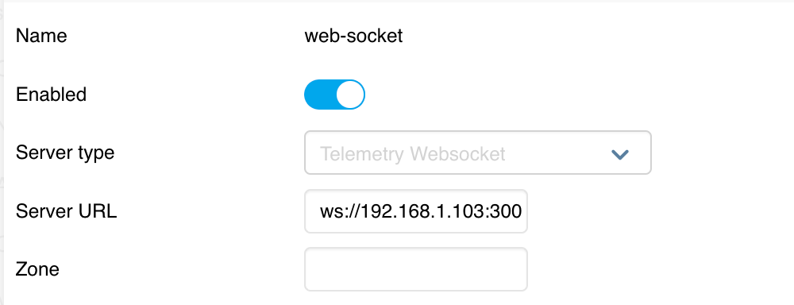
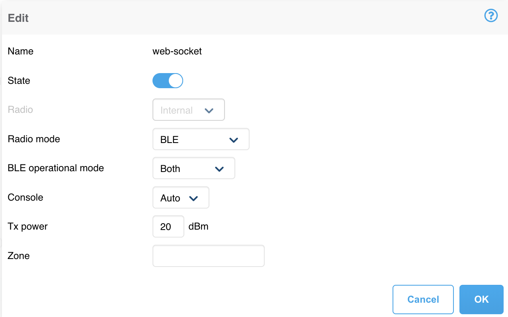

# Connect to aruba access point

## Prerequisite

1. Aruba access point is running
2. Setting on Aruba Instant
   Configuration -> service -> IoT
   add IoT Transports and IoT Radio \*\*\* Server URL should be your Server IP and Port must be `3001`
   
   


## How to run with command

Install modules
`npm install`

Run app
`node app.js`

## How to connect IoT device to Aruba

```
aruba-connection
|-- action
    |-- connection.json
```
config on json file
### example
```json
{
   "meta": {
      "access_token": "{your_access_token}",
      "version": 1,
      "sbTopic": "actions"
   },
   "actions": [
      {
         "deviceMac": "{iot_mac_address}",
         "serviceUuid": null,
         "value": null,
         "characteristicUuid": null,
         "actionId": "00000001",
         "timeOut": 20,
         "type": "bleConnect"
      }
   ],
   "receiver": {
      "apMac": "{access_point_mac_address}",
      "all": false
   }
}
```

Run python file
`python3 sbapi_send.py3`

select `5` to Connect with IoT Device

```
"==============================="
"Choose one of the following SouthBound options:"
" 1. Exit"
"-----------"
" 2. Send SerialData CO_RD Enocean message"
" 3. Send custom SerialData JSON via file"
"-----------"
" 4. Send BLE Action sb_action_set_1.json"
" 5. Send BLE Action connect.json"
" 6. Send BLE Action disconnect.json"
" 7. Send custom BLE JSON via file"
"==============================="
" 8. Request connected AP topology from websocket server"
" 9. Request connected AP information from websocket server"
"==============================="
```

